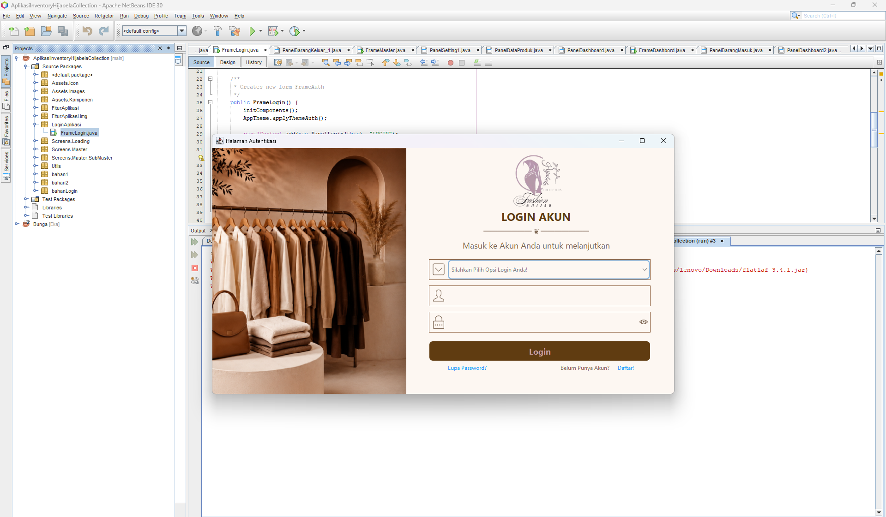
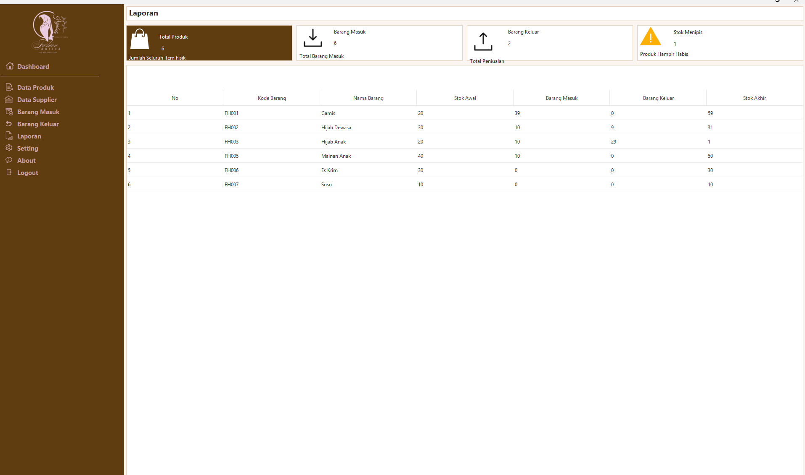

--- 

🏪 Aplikasi Inventory Hijabela Collection

Aplikasi Inventory Hijabela Collection merupakan aplikasi yang dibuat untuk membantu UMKM Hijabela Collection dalam mengelola persediaan barang secara lebih efektif dan efisien.

---

📖 Deskripsi Projek

Projek ini dibuat untuk memenuhi tugas kelompok Semester 2 pada mata kuliah Pemrograman Lanjutan.

Aplikasi ini dikembangkan untuk membantu proses pengelolaan inventory, mulai dari pencatatan data produk, barang masuk, barang keluar/penjualan, hingga pemantauan stok dan riwayat barang.

## ✨ Fitur Utama 

- Login
- Dashboard
- Data Produk
- Data Supplier
- Barang Masuk
- Barang Keluar/Penjualan
- Laporan Stok
- Riwayat Barang
- Profil
- Logout

---

## Tampilan Aplikasi Inventory Hijabela Collection

Tampilan Fitur Login :

Tampilan Fitur Aplikasi Laporan : 

---

## 👥 Tim Pengembang

Berikut informasi kontribusi setiap anggota kelompok:

### 1. Eka (Enigma Faceless)

**Kontribusi:**
- Membuat Analisis Kebutuhan untuk menentukan fitur-fitur aplikasi yang dibutuhkan.
- Membuat Rancangan Database ERD dan Relasi Tabel.
- Membuat Database di XAMPP dengan nama `aplikasi_hijabella_collection`.
- Membuat Desain Implementasi:
  - PanelBarangMasuk.java
  - PanelDataProduk.java
  - PanelAbout2.java
  - pengaturanAkun.java (Setting)
- Melakukan coding pada fitur:
  - Dashboard (PanelDashboard.java)
  - Barang Masuk (PanelBarangMasuk.java)
  - Barang Keluar (PanelBarangKeluar.java)
  - Data Produk (DataProduk.java)
  - Data Supplier (DataSupplier.java)
  - Laporan (Laporan.java)
  - Pengaturan Akun (Sedang dalam Proses Pengembangan)
  - Logout 

**Link GitHub :** https://github.com/EnigmaFaceless

---

### 2. Aulia Asmarani

**Kontribusi:**
- Membuat Desain UI/UX Aplikasi Hijabella Collection di Canva.
- Membuat Desain Implementasi:
  - FrameDashboard.java
  - PanelDashboard.java
  - PanelBarangKeluar.java
  - PanelDataSupplier.java
  - PanelLaporan.java
- Membuat class `koneksi.java` yang berisi kode untuk menghubungkan aplikasi ke Database.
- - Melakukan coding pada fitur:
  - Dashboard (FrameDashboard.java)

**Link GitHub :** https://github.com/auliaasmarani

---

### 3. Achmad Khusnul Yakin 

**Kontribusi:**
- Membuat Analisis Kebutuhan untuk menentukan fitur-fitur aplikasi yang dibutuhkan.
- Membuat Desain PanelLogin.java
- Membuat Desain FrameLogin.java
- Melakukan coding pada fitur :
- Login (frameLogin.java)

**Link GitHub :** https://github.com/DigiVora

---

### 4. M. Tijani Waffa Haqiqi

**Kontribusi:**
- Membuat Desain ERD menggunakan Draw.io.
- Melakukan pengujian aplikasi.

**Link GitHub :** https://github.com/waffahaqiqi-arch

---

### 5. Ahmad Fathoni Shidqon

**Kontribusi:**
- Membuat Desain Relasi Tabel menggunakan Draw.io.
- Melakukan pengujian aplikasi.

**Link GitHub :** https://github.com/Ftony-hub

---

### 6. Muhammad Atho'ilL Hakim

**Kontribusi:**
- Melakukan pengujian aplikasi.

**Link GitHub :** https://github.com/hakimathoil2-dev

---

### 7. Raihan Chayin

**Kontribusi:**
- Melakukan pengujian aplikasi.

**Link GitHub :** https://github.com/raihanchayin36-coder

---

🎯 Tujuan Projek
Projek ini bertujuan untuk:
Membantu pengelolaan persediaan barang.
Mempermudah pencatatan barang masuk dan barang keluar.
Membantu pengguna dalam memantau stok barang.
Menyediakan pengelolaan data inventory secara terkomputerisasi.
Menerapkan materi Pemrograman Lanjutan dalam pengembangan aplikasi.
🚀 Cara Menjalankan Aplikasi
Clone repository dari GitHub.
Buka projek menggunakan NetBeans.
Jalankan XAMPP.
Aktifkan Apache dan MySQL.
Import database aplikasi ke MySQL.
Sesuaikan konfigurasi koneksi database apabila diperlukan.
Jalankan aplikasi melalui NetBeans.
📚 Mata Kuliah
Projek ini dibuat sebagai tugas kelompok pada:
Pemrograman Lanjutan — Semester 2
Program Studi Sistem Informasi
Institut Teknologi Mojosari
📄 License
Projek ini dibuat untuk keperluan pembelajaran dan tugas akademik.
📞 Contact
Untuk informasi lebih lanjut mengenai projek, silakan menghubungi anggota tim pengembang melalui akun GitHub yang tercantum pada bagian Tim Pengembang.

---

## 💻 TEKNOLOGI YANG DIGUNAKAN

- **Java**
- **NetBeans**
- **MySQL**
- **XAMPP**
- **Canva**
- **Draw.io**
- **Git**
- **GitHub**

